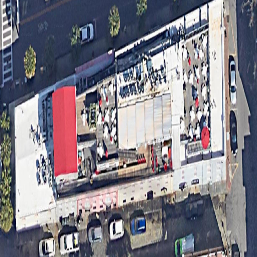
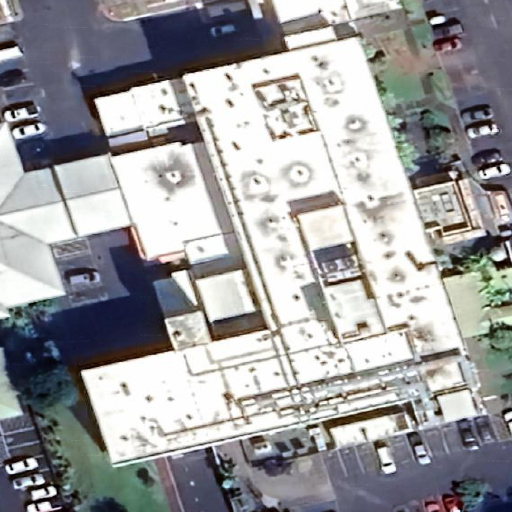
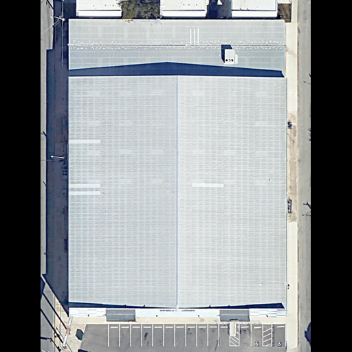
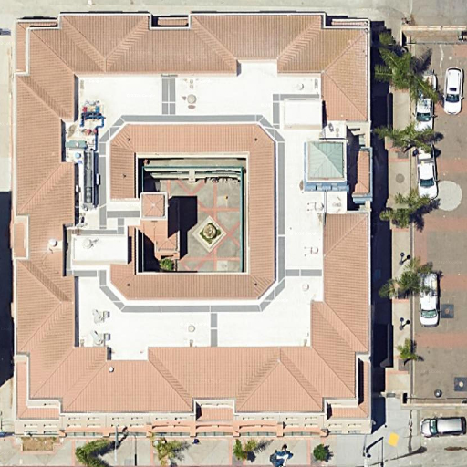
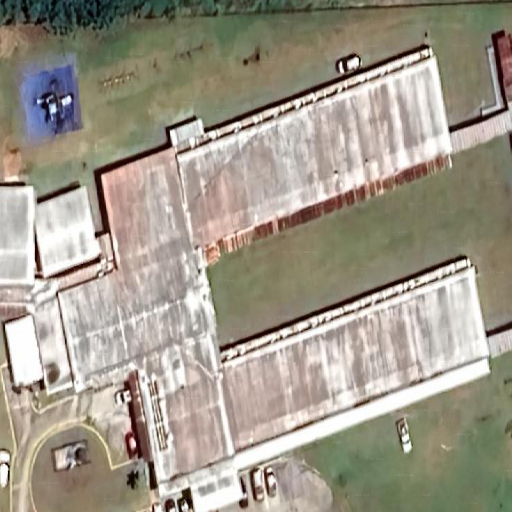
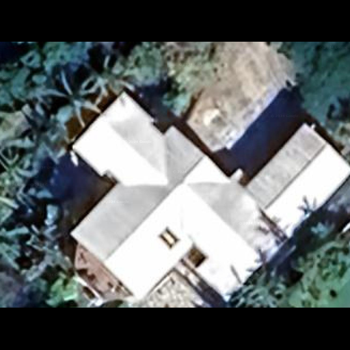
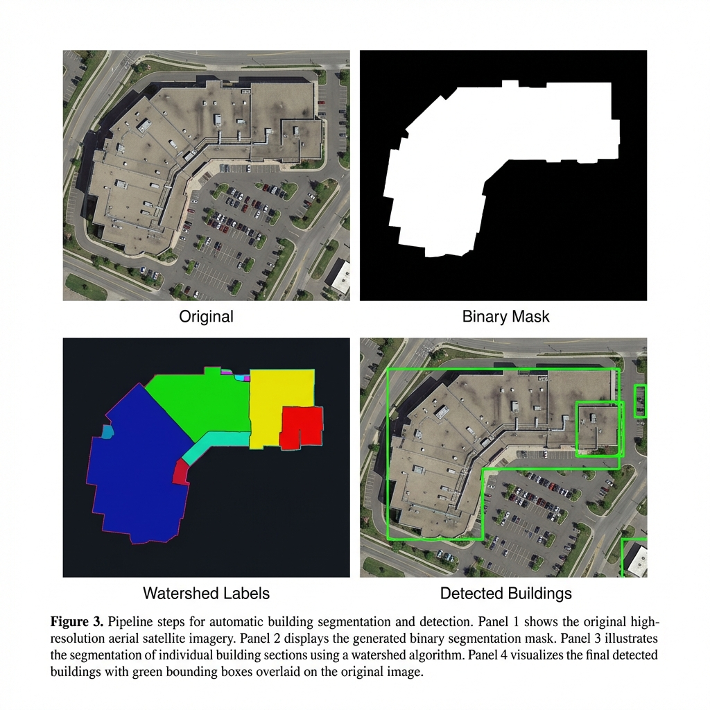

# 🏗️ Building Classification from Aerial Imagery using DenseNet201

[](https://www.python.org/)
[](https://tensorflow.org/)
[](LICENSE)
[](#-model-performance)

A deep learning pipeline for classifying buildings from satellite imagery into **7 distinct categories** using DenseNet201 with integrated segmentation. This repository accompanies our research paper on automated building classification.

---

## 📋 Abstract

Building classification from aerial imagery is crucial for urban planning, infrastructure evaluation, environmental monitoring, and disaster response. This research presents a **two-stage deep learning pipeline** combining:

1. **ReFineNet Segmentation** - Precise building footprint extraction
2. **DenseNet201 Classification** - Multi-class building type prediction

We introduce a novel U.S.-wide dataset collected from **Google Earth** imagery covering diverse geographic regions and architectural styles. Our model achieves **84.40% test accuracy** across 7 building categories.

---

## 🎯 Building Classes

| Class | Description | Example Characteristics |
|-------|-------------|------------------------|
| **Commercial** | Retail, offices, shopping centers | Large footprints, parking lots |
| **High-rise** | Multi-story towers (>10 floors) | Vertical structures, small footprint |
| **Hospital** | Healthcare facilities | H-shaped, helicopter pads |
| **Industrial** | Factories, warehouses | Large flat roofs, loading docks |
| **Multi-family** | Apartments, condos | Clustered units, regular patterns |
| **Schools** | Educational institutions | Athletic fields, bus loops |
| **Single-family** | Detached homes | Individual lots, varied rooflines |

### 📸 Sample Building Images

<table>
<tr>
<td align="center"><b>Commercial</b><br></td>
<td align="center"><b>High-rise</b><br></td>
<td align="center"><b>Hospital</b><br></td>
<td align="center"><b>Industrial</b><br></td>
</tr>
<tr>
<td align="center"><b>Multi-family</b><br></td>
<td align="center"><b>Schools</b><br></td>
<td align="center"><b>Single-family</b><br></td>
<td align="center"><i>512×512 px<br>~0.15 m/pixel</i></td>
</tr>
</table>

---

## 📊 Dataset Availability
- **Phase 2 (Paper Dataset)**: [](https://doi.org/10.5281/zenodo.18512944)
  - Contains the 1,553 images used to achieve 84.40% accuracy.
- **Combined (Full)**: [](https://doi.org/10.5281/zenodo.18513307)
  - Contains 18,147 unique images for extended research.

The dataset includes 7 building classes:
- **Commercial**
- **High-rise**
- **Hospital**
- **Industrial**
- **Multi-family**
- **Schools**
- **Single-family**

---

## 🔬 Methodology

### Pipeline Architecture

```
┌─────────────────┐     ┌──────────────────┐     ┌─────────────────┐     ┌────────────────┐
│  Google Earth   │────▶│   ReFineNet      │────▶│   DenseNet201   │────▶│  Building      │
│  Satellite      │     │   Segmentation   │     │   Classifier    │     │  Class         │
│  512×512 @ 0.15m│     │   + Watershed    │     │   (7 classes)   │     │  Prediction    │
└─────────────────┘     └──────────────────┘     └─────────────────┘     └────────────────┘
```

### Key Technical Components

**Data Acquisition (§3.1.1)**
- Source: Google Earth via [segment-geospatial](https://github.com/opengeos/segment-geospatial) (samgeo)
- Resolution: 512×512 pixels at ~0.15 m/pixel
- Coverage: 50 U.S. states with diverse architectural styles

---

## 🔍 Segmentation Pipeline (§3.2)

Our segmentation module extracts individual building footprints from satellite imagery using a multi-stage approach:

### Segmentation Architecture

```
┌─────────────┐    ┌─────────────┐    ┌─────────────┐    ┌─────────────┐    ┌─────────────┐
│   INPUT     │    │   TTA       │    │  REFINENET  │    │  MORPH OPS  │    │  WATERSHED  │
│  512×512    │───▶│  H/V Flip   │───▶│  Building   │───▶│  Opening    │───▶│  Algorithm  │
│  Satellite  │    │  4 versions │    │  Masks      │    │  Clean up   │    │  Separate   │
└─────────────┘    └─────────────┘    └─────────────┘    └─────────────┘    └──────┬──────┘
                                                                                   │
                   ┌─────────────┐    ┌─────────────┐    ┌─────────────┐          │
                   │  BUILDING   │◀───│   SIZE      │◀───│   LABELED   │◀─────────┘
                   │   CROPS     │    │   FILTER    │    │   REGIONS   │
                   │  for CNN    │    │ 500-100K px │    │             │
                   └─────────────┘    └─────────────┘    └─────────────┘
```

### Step-by-Step Process

| Step | Operation | Description | Paper Reference |
|:----:|-----------|-------------|-----------------|
| 1️⃣ | **Preprocessing** | Resize to 512×512, normalize pixels to [0,1] | §3.2 |
| 2️⃣ | **TTA** | Generate H-flip, V-flip, HV-flip versions | §3.2 |
| 3️⃣ | **ReFineNet** | Pretrained semantic segmentation network | Lin et al., 2017 |
| 4️⃣ | **Averaging** | Average TTA predictions for robust masks | §3.2 |
| 5️⃣ | **Morphological Opening** | Remove small artifacts and noise | §3.2 |
| 6️⃣ | **Watershed** | Separate connected/overlapping buildings | Meyer, 1994 |
| 7️⃣ | **Size Filtering** | Keep segments with 500-100,000 pixels | §3.2 |

### 📸 Segmentation Pipeline Visualization

<p align="center">

</p>

**Pipeline Steps:**
1. **Original** - High-resolution satellite imagery (512×512 px)
2. **Binary Mask** - Building footprints extracted by ReFineNet
3. **Watershed Labels** - Individual buildings separated with color-coded regions
4. **Detected Buildings** - Final output with green bounding boxes

> *"Post-processing further refined these masks by applying morphological opening to eliminate small artifacts and reduce noise, followed by the watershed algorithm, chosen for its efficacy in segmenting connected or overlapping building structures."* — Paper §3.2

---

**Classification Model (§3.2)**
- Backbone: DenseNet201 (ImageNet pretrained)
- Head: GAP → Dense(256, ReLU, L2=0.001) → Dropout(0.5) → Softmax(7)

---

## ⚙️ Training Configuration

Hyperparameters from **Table 4** in the paper:

| Parameter | Value | Notes |
|-----------|-------|-------|
| Optimizer | Adam | β₁=0.9, β₂=0.999 |
| Learning Rate | 1e-4 | Reduced on plateau |
| Batch Size | 32 | Balanced memory/speed |
| Max Epochs | 20 | Early stopping applied |
| Dropout Rate | 0.5 | FC layer regularization |
| L2 Regularization | 0.001 | Dense layer |
| Early Stopping | patience=3 | Restore best weights |
| LR Scheduler | ReduceLROnPlateau | factor=0.2, patience=2 |

**Data Augmentation:**
- Horizontal/Vertical flips
- Rotation: ±15°
- Zoom: 90-110%
- Brightness adjustment

**Data Split:** 80% train / 10% validation / 10% test

---

## 📊 Model Performance

### Overall Metrics

| Metric | Score |
|--------|-------|
| **Test Accuracy** | **84.40%** |
| **Validation Accuracy** | 84.39% |
| **Training Accuracy** | >95% |
| **Macro F1-Score** | 0.84 |
| **Weighted F1-Score** | 0.84 |

### Per-Class Performance (Table 5)

| Class | Precision | Recall | F1-Score | Support |
|-------|:---------:|:------:|:--------:|:-------:|
| Commercial | 0.80 | 0.60 | 0.69 | 20 |
| **High-rise** | **0.95** | 0.90 | **0.92** | 20 |
| Hospital | 0.84 | 0.80 | 0.82 | 20 |
| Industrial | 0.83 | **0.95** | 0.89 | 21 |
| Multi-family | 0.77 | 0.85 | 0.81 | 20 |
| Schools | 0.77 | 0.85 | 0.81 | 20 |
| **Single-family** | **0.95** | **0.95** | **0.95** | 20 |
| **Overall** | **0.85** | **0.84** | **0.84** | **141** |

### Key Findings

✅ **Best Performance**: Single-family (F1=0.95) and High-rise (F1=0.92)
- Distinct architectural features make classification easier

⚠️ **Challenging Classes**: Commercial (F1=0.69)
- Often confused with Multi-family due to similar footprint patterns

### 🔍 Classification Example

Here's an example of how the model classifies a building:

| Input Image | Prediction |
|:-----------:|:-----------|
|  | **Predicted Class:** High-rise<br>**Confidence:** 95%<br>**Ground Truth:** High-rise ✅ |

**Probability Distribution:**
```
Commercial   ████░░░░░░░░░░░░░░░░  2.1%
High-rise    ████████████████████  95.0%  ◄ Predicted
Hospital     ░░░░░░░░░░░░░░░░░░░░  0.5%
Industrial   ░░░░░░░░░░░░░░░░░░░░  0.3%
Multi-family █░░░░░░░░░░░░░░░░░░░  1.2%
Schools      ░░░░░░░░░░░░░░░░░░░░  0.4%
Single       ░░░░░░░░░░░░░░░░░░░░  0.5%
```

---

## 📂 Repository Structure

```
building-classification/
├── 📄 README.md                 # This file
├── 📄 LICENSE                   # MIT License
├── 📄 CITATION.cff              # Citation metadata
├── 📄 requirements.txt          # Python dependencies
│
├── 📁 notebooks/
│   ├── 01_data_collection.ipynb           # Satellite image acquisition
│   ├── 02_preprocessing_segmentation.ipynb # ReFineNet + watershed
│   ├── 03_model_training.ipynb            # DenseNet201 training
│   └── 04_evaluation_inference.ipynb      # Metrics & predictions
│
├── 📁 data/
│   └── processed/               # Train/Val/Test splits
│       ├── train/               # 80% of data
│       ├── val/                 # 10% of data
│       └── test/                # 10% of data (141 images)
│
├── 📁 models/                   # Trained weights
│   └── README.md                # Download instructions
│
├── 📁 results/                  # Figures & metrics
│   └── figures/
│
└── 📁 paper/                    # Research paper
```

---

## 🚀 Quick Start

### Installation

```bash
# Clone repository
git clone https://github.com/madhugoutham/building-classification.git
cd building-classification

# Create environment
python -m venv venv
source venv/bin/activate  # Windows: venv\Scripts\activate

# Install dependencies
pip install -r requirements.txt
```

### Inference Example

```python
from tensorflow.keras.models import load_model
from tensorflow.keras.preprocessing import image
import numpy as np

# Load model
model = load_model('models/densenet201_best.h5')

# Building classes
CLASSES = ['Commercial', 'High', 'Hospital', 'Industrial', 
           'Multi', 'Schools', 'Single']

# Predict
img = image.load_img('building.tif', target_size=(224, 224))
x = image.img_to_array(img) / 255.0
x = np.expand_dims(x, axis=0)

pred = model.predict(x)
print(f"Predicted: {CLASSES[np.argmax(pred)]} ({np.max(pred)*100:.1f}%)")
```

---

## 📚 Comparison with Related Work

| Study | Year | Classes | Accuracy | Region |
|-------|------|---------|----------|--------|
| Helber et al. (EuroSAT) | 2019 | 10 land-use | 98.57% | Europe |
| Atwal et al. (OSM) | 2022 | 2 | 98% | US (3 counties) |
| Dimassi et al. (BBTC) | 2021 | 2 | 94.8% | Lebanon |
| Erdem & Avdan (Inria) | 2020 | Binary | 87.69% | US (Chicago) |
| **This Work** | **2025** | **7** | **84.40%** | **US (nationwide)** |

---

## 🔧 Requirements

- Python 3.8+
- TensorFlow 2.x
- CUDA GPU (recommended for training)
- 8GB+ RAM

See [requirements.txt](requirements.txt) for full dependencies.

---

## 📥 Model Weights

Pre-trained model weights (hosted externally due to size):

| Model | Size | Description |
|-------|------|-------------|
| `densenet201_best.h5` | ~80MB | Best validation accuracy |

See [models/README.md](models/README.md) for download instructions.

---

## 📖 Citation

```bibtex
@article{author2025building,
  title={Building Classification from Aerial Imagery using DenseNet201},
  author={Author Name},
  journal={Journal Name},
  year={2025}
}
```

See [CITATION.cff](CITATION.cff) for machine-readable citation.

---

## 📜 License

This project is licensed under the MIT License - see [LICENSE](LICENSE) for details.

---

## 🙏 Acknowledgments

- **Google Earth** for satellite imagery
- **[segment-geospatial](https://github.com/opengeos/segment-geospatial)** (samgeo) for image acquisition
- **TensorFlow/Keras** for DenseNet201 implementation
- **ReFineNet** for building segmentation

---

## 📧 Contact

For questions, issues, or collaboration inquiries, please [open an issue](https://github.com/madhugoutham/building-classification/issues).
